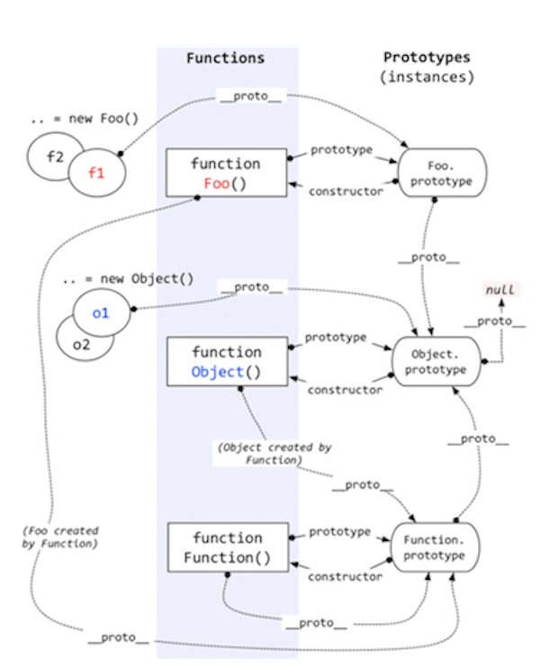

<!--
 * @Author: monai
 * @Date: 2020-03-23 17:36:49
 * @LastEditors: monai
 * @LastEditTime: 2020-05-11 14:18:16
 -->
# JS 数据类型判断

常用的typeOf、instanceof、Object.prototype.toString.call()，其中Object.prototype.toString.call() 效果最好，基本类型、内置对象多能区分出来。


## typeof  
typeof 可以判断出很多数据类型，但是到 null 和部分内置对象得时候就会显得无力，代码如下:

```javascript
    typeof null; //"object"
    typeof [1]; //"object"
```
为什么typeof null; 会返回 ”object“呢？  
因为：js 在底层存储变量的时候，会在变量的机器码的低位1-3位存储其类型信息：
* 000 对象
* 100 字符串
* 110 布尔
* .....

而 null 的机械码全部是0，所以 typeof 在判断 null 的时候会出现”object“的错误问题。

typeof 可以返回一下的值：
| 类型 | 示例 | 返回值 |
| ---- | ---- |---- |
| 字符串 | typeof 'abc' | string |
| 数  值 | typeof 123 | number |
| 布  尔 | typeof true | boolean |
| Function | typeof function(){} | function |
| Undefined | typeof undefined | undefined |
| BigInt | let a = BigInt(1); typeof a; | bigint |
| Symbol | let a = Symbol(); typeof a; | symbol |
| null | typeof null | object |
| Map | let a = new Map(); typeof a; | object |
| Set | let a = new Set(); typeof a;  | object |
| Array | typeof [] | object |
| Object | typeof {} | object |

## instanceof  
instanceof 语法是判断：右边参数的 prototype 是否在左边参数的原型链上（`__proto__`）。**注意：右边的参数如果没有 prototype，只有 `__proto__` 那么会JS报错，报错提示如下：**  
**Uncaught TypeError: Right-hand side of 'instanceof' is not callable**  

判断的方法如此，那么就有很多有趣的判断，示例：  

```javascript
    Object instanceof Object // true
    Function instanceof Function // true
    Function instanceof Object // true
```
首先放张原型链的图：

### Object instanceof Object
```javascript
    Object.__proto__ == Function.prototype
    Function.prototype.__proto__ == Object.prototype 
    Object instanceof Object // true
```
### Function instanceof Function
```javascript
    Function.__proto__ == Function.prototype
    Function instanceof Function // true
```
### Function instanceof Object
```javascript
    Function.__proto__ == Function.prototype
    Function.prototype.__proto__ == Object.prototype 
    Object instanceof Object // true
```

## Object.prototype.toString.call()  
Object.prototype.toString.call() 判断的最为齐全，可以直接判断出是哪些类型。  
Object.prototype.toString 方法是JS中内置的获取 `ES5: [[clasee]] ES6:internal slot ` 类型的方法，也是唯一的方法。  
Object.toString 方法返回的是一个函数，而 Object.prototype.toString 则是返回`[object xxx]`这样的字符串。  
**注意：Array、String 等toString 都会返回 "function Date() { [native code] }"，而只有Math.toString() 则会直接返回 "[object Math]"**  
示例：
```javascript
    Error.toString();
    // "function Error() { [native code] }"
    
    let err = new Error();
    Object.prototype.toString.call(err);
    // "[object Error]"

    Math.toString();
    // "[object Math]"  

    Object.prototype.toString.call(Math);
    // "[object Math]"  
```

**注意：特殊示例"** 
```javascript
    let a = Object(BigInt(1));
    Object.prototype.toString.call(a);
    //  "[object BigInt]"

    let a = Object(BigInt(1));
    a.__proto__ = Object.prototype;
    Object.prototype.toString.call(a);
    //  "[object Object]"
```
**注意：再来看另外一个"** 
```javascript
    let a = [];
    a.__proto__ = Object.prototype;
    Object.prototype.toString.call(a)
    //  "[object Array]"
```
这里有点疑问我也没弄太懂。常规使用判断方法足够，有机会看到相关的知识再更新吧。我估计是涉及到一些内置类型存储的规则问题。