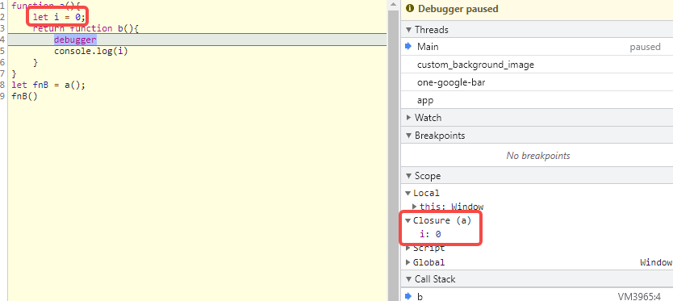
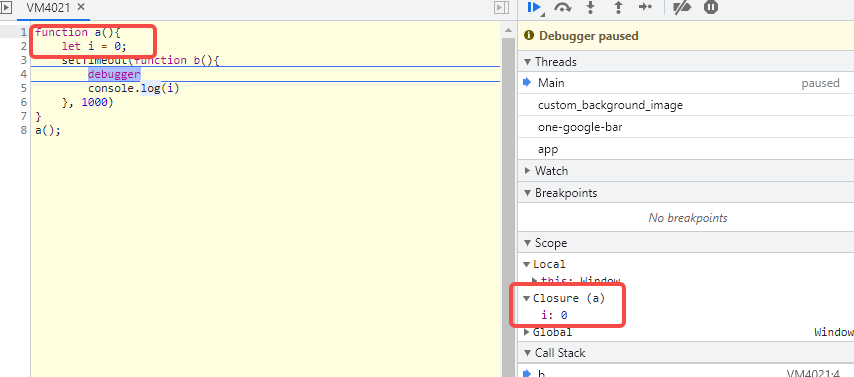
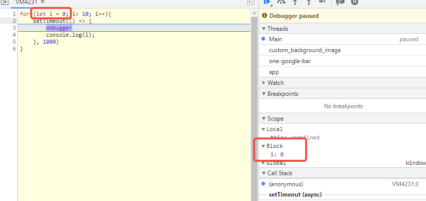
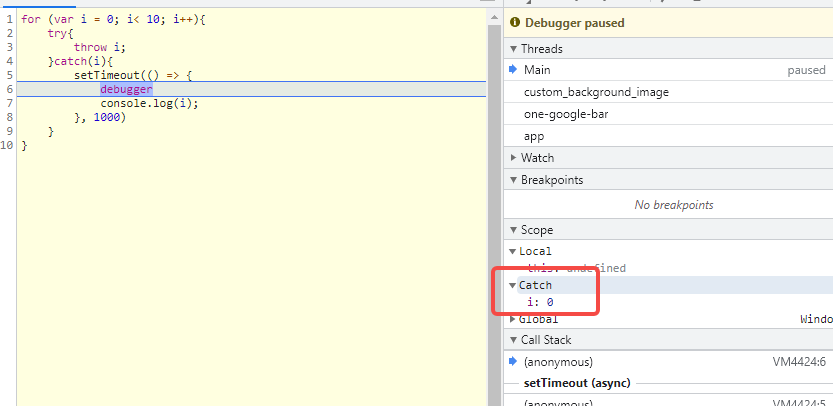
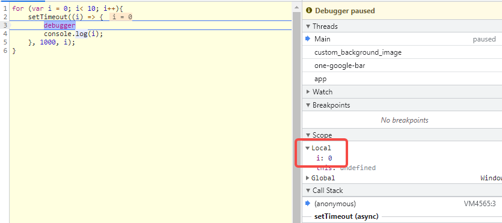

<!--
 * @Author: monai
 * @Date: 2021-09-02 16:11:07
 * @LastEditors: monai
 * @LastEditTime: 2021-09-02 18:06:41
-->
# 闭包 Closure 

## 一. 定义
三个要素：
1. 函数A内嵌套一个函数B
2. 函数B内有使用、引用函数A作用域内的变量
3. 函数B执行时上下文与定义时作用域（调用时不在 函数A 内）不同

## 2. 示例
### 1. 经典的闭包
```javascript 
function a(){
    let i = 0;
    return function b(){
        console.log(i)
    }
}
let fnB = a();
fnB()
```
**解析：**
 - 函数 b 嵌套在函数 a 内部【要素1】
 - 使用了 i 变量【要素2】
 - 函数 b 执行时上下文与定义时不同【要素3】

**图示：**



### 二. 通过定时器制造闭包
```javascript 
function a(){
    let i = 0;
    setTimeout(function b(){
        console.log(i)
    }, 1000)
}
a();
```
**解析：**
 - 函数 b 嵌套在函数 a 内部【要素1】
 - 使用了 i 变量【要素2】
 - 函数 b 执行时上下文与定义时不同【要素3】

**图示：**



## 三. 闭包经典面试题
改造下面的代码，使之输出0 - 9，写出你能想到的所有解法。
**参考：https://github.com/Advanced-Frontend/Daily-Interview-Question/issues/43**
```javascript 
for (var i = 0; i< 10; i++){
   setTimeout(() => {
    console.log(i);
   }, 1000)
}
```
**解析：**
输出 10*10 的原因是`setTimeout`执行时 i 获取的是全局变量 i 的值，而不是每次循环的值。
`for` 循环中 `var` 声明的变量重复覆盖，并且都全局变量。

### 1. 通过闭包
```javascript 
for (var i = 0; i< 10; i++){
    ((i)=>{
        setTimeout(() => {
            console.log(i);
        }, 1000)
    })(i);
}
```
### 2. 通过创建块状作用域
- **Ⅰ、let 创建**
```javascript 
for (let i = 0; i< 10; i++){
    setTimeout(() => {
        console.log(i);
    }, 1000)
}
```
**解析：** 将 `var` 修改为 `let`，利用 `let` 在每次 `for` 循环中创建块状作用域，从而相互隔离 i。
**参考：https://javascript.info/closure#for-while**
**图示：**


- **Ⅱ、try/catch** 
```javascript 
for (var i = 0; i< 10; i++){
    try{
        throw i;
    }catch(i){
        setTimeout(() => {
            console.log(i);
        }, 1000)
    }
}
```
**解析：** `catch` 会创建一个块状作用域。
**图示：**


### 3. 通过setTimeout 第三个参数传参
```javascript 
for (var i = 0; i< 10; i++){
    setTimeout((i) => {
        console.log(i);
    }, 1000, i);
}
```
或
```javascript 
for (var i = 0; i< 10; i++){
    setTimeout(console.log, 1000, i);
}
```
**解析：** 通过传参使输出`log`的值为每次循环时的 `i`。
**图示：**



