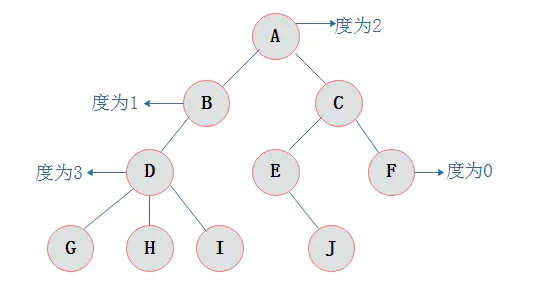
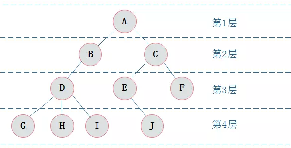
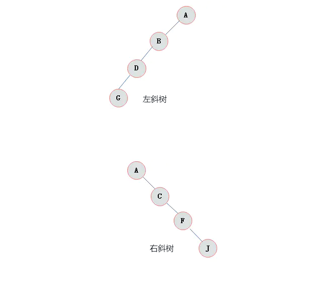
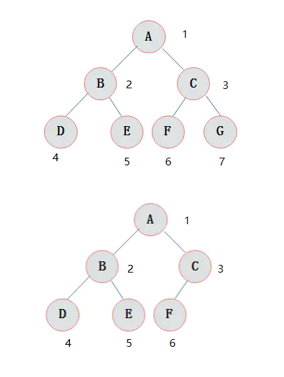
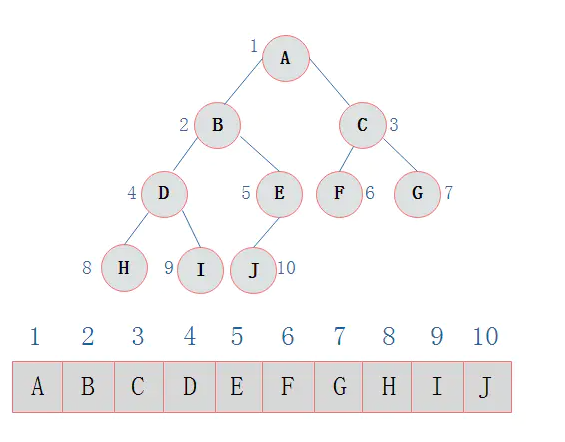
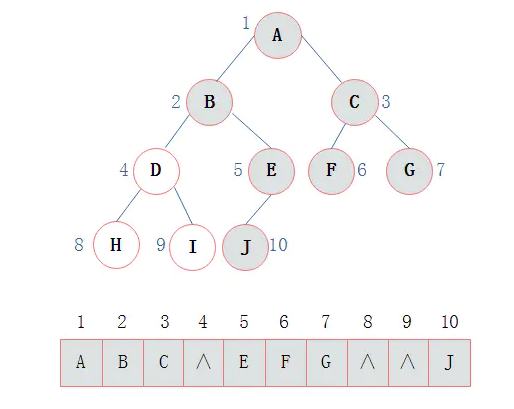
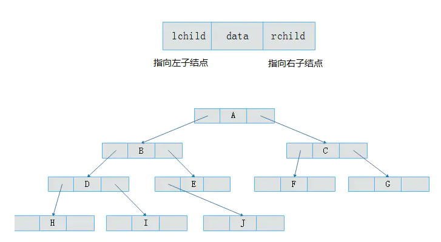

<!--
 * @Author: monai
 * @Date: 2021-08-13 15:59:25
 * @LastEditors: monai
 * @LastEditTime: 2021-08-27 18:48:18
-->
# 二叉树
## 一、树
1. 树：
    - 只有一个根结点。
    - 子树个数没有限制，但是互不相交。

2. 度：结点拥有子树的数目称为结点的度。图示：

3. 结点关系(上图为例)：
    - A<->B 父子关系
    - B<->C 兄弟结点

4. 结点层次：根为第一层，依此类推。图示：

5. 深度：树中最大层次数为数的深度或高度。示例：上图深度为 4。

## 二、二叉树
### 基础特性
1. 二叉树特点：
    - 每个结点最多有两颗子树，不存在度大于 2 的结点。
    - 左、右 子树是有顺序的，次序不能颠倒。
    - 结点只有一个子树也要区分是左还是右子树。

2. 二叉树性质：
    - 在二叉树的第 i 层上最多有 2^i-1^ 个节点 。（i>=1)
    - 二叉树深度为 K，那么最多有 2^k^-1 个结点。（k>=1）
    - n~0~ = n~2~+1， 
      * n~0~: 度数为 0 的结点。
      * n~2~: 度数为 2 的结点。
    - 在完全二叉树中，具有 n 个结点的完全二叉树的深度 K 为 $(\log_2 n)$ +1，其中$(\log_2 n)$向下取整。
      * k =< $(\log_2 n)$ +1
    - 若对含 n 个结点的完全二叉树从上到下且从左至右进行 1 至 n 的编号，则对完全二叉树中任意一个编号为 i 的结点有如下特性：
      * 若 2i>n，则该结点无左子结点， 否则，编号为 2i 的结点为其左子结点；
      * 若 2i+1>n，则该结点无右子结点， 否则，编号为2i+1 的结点为其右子结点。

### 树类型
1. 斜树：所有的结点都只有左子树的二叉树叫左斜树。所有结点都是只有右子树的二叉树叫右斜树。这两者统称为斜树。图示：

2. 满二叉树：如果所有分支结点都存在左子树和右子树，并且所有叶子都在同一层上，这样的二叉树称为满二叉树。图示：

3. 完全二叉树：对一颗具有n个结点的二叉树按层编号，如果编号为i(1<=i<=n)的结点与同样深度的满二叉树中编号为i的结点在二叉树中位置完全相同，则这棵二叉树称为完全二叉树。图示：

**特点**
  - 叶子结点只能出现在最下层和次下层。
  - 最下层的叶子结点集中在树的左部。
  - 倒数第二层若存在叶子结点，一定在右部连续位置。
  - 如果结点度为1，该结点只有左子结点，没有右子树。
  - 同样结点数目的二叉树，完全二叉树深度最小。
  - 满二叉树一定是完全二叉树，但反过来不一定成立。比如：完全二叉树不要求叶子结点在同一层。

### 存储类型
1. 顺序存储

- **非空：** 二叉树的顺序存储结构就是使用一维数组存储二叉树中的结点，并且结点的存储位置，就是数组的下标索引。**二叉树为完全二叉树、满二叉树，结点数刚好填满数组。** 图示：

- **存在空：** 如下图示：

2. 二叉链表
当二叉树不是**完全/满 二叉树** 时，顺粗存储会浪费大量空间，由此引入链表存储，此种链表称为：**二叉链表**。图示：

## 参考
https://www.jianshu.com/p/bf73c8d50dc2
https://leetcode-cn.com/problems/binary-tree-preorder-traversal/solution/javascriptjie-qian-xu-bian-li-er-cha-shu-by-user77/